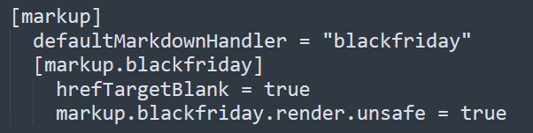
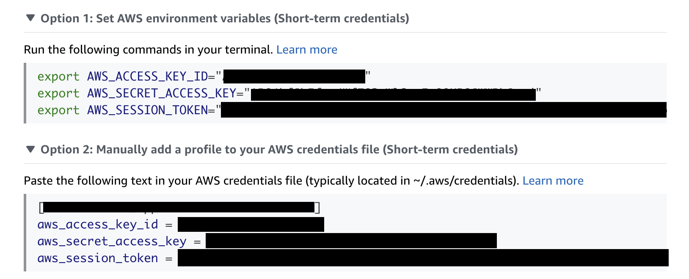

# FSO CCO Compentency Workshop Lab Guide

Hugo Lab Guide template for the FSO Cisco Cloud Observability (CCO) Competency Workshop.

## Prerequisites

- Install [Hugo](https://gohugo.io/) on your workstation. (See **Hugo Bug Update** below.)
- Install your favorite text editor.
- A working knowledge of Markdown (see [here](https://github.com/adam-p/markdown-here/wiki/Markdown-Cheatsheet) for a reference).

## Hugo Bug Update!

October 25th, 2022: Discovered a major BUG if you are using a Hugo version that is greater than Hugo 
[v0.99.0](https://github.com/gohugoio/hugo/releases/tag/v0.99.0). Later versions of Hugo no longer support the **"blackfriday"** 
markdown handler and force you to use the **"goldmark"** markdown handler.  

If you use the **"goldmark"** markdown handler, then most or all of the built-in [font awesome](https://fontawesome.com/) icons 
will not get rendered in your pages.  

You can find references to the markdown handler defined in the **"config.toml"** file in the section seen in the image below.  

The recommended work-around is to uninstall your current Hugo version (if later version than v0.99.0); install 
Hugo [v0.99.0](https://github.com/gohugoio/hugo/releases/tag/v0.99.0); and ensure your **"config.toml"** file has the 
**"blackfriday"** markdown handler defined:

In addition, Hugo will fail to deploy to an AWS S3 bucket if the AWS CLI is configured to use SSO to obtain auth tokens. You 
will need to manually set the non-refreshable auth data. This data is available through your AWS Foundation SSO chiclet in Okta 
under the Programatic / CLI Access option for the Partner Enablement account.

Source: [https://github.com/hashicorp/terraform/issues/32465#issuecomment-1401813701](https://github.com/hashicorp/terraform/issues/32465#issuecomment-1401813701).

## How to Create Content

- Add content in Markdown language to the `content` folder.
  - Folders can be added. They will be displayed in the side menu in alphabetical order. There are sample files to show how content is organized.

### Download the theme locally

The lab template repo has a dependency on the `hugo-theme-learn` git project from `matcornic`. In order to test content locally and eventually build the project, you will need to download the theme (it is set up as a submodule within this project).

Follow these steps if the theme does not automatically download when you clone the repo. From the directory of your repo fork, run `git submodule update --init --recursive` to download the contents of the theme.
